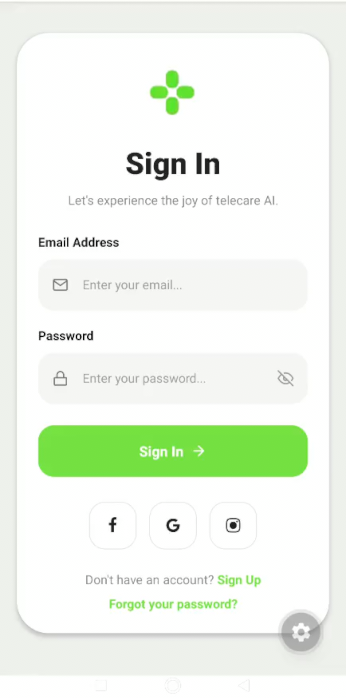
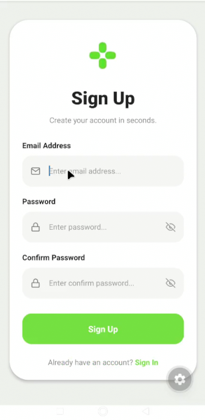
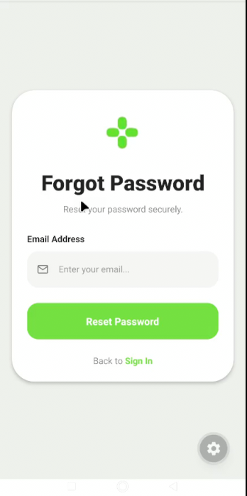

# Mobile Authentication UI

A simple mobile authentication UI built using React Native and Expo.

## Features

- Sign In Screen
- Sign Up Screen
- Forgot Password Screen
- Basic screen navigation using state
- Responsive mobile layout
- Clean modern UI inspired by Dribbble

## Tech Stack

- React Native
- Expo
- TypeScript
- Expo Vector Icons

## Screens

### Sign In



### Sign Up



### Forgot Password



## Installation

```bash
npm install
```

## Run Project

```bash
npx expo start
```

## Project Structure

```bash
.
├── app
│   └── index.tsx
├── assets
│   └── logo.png
└── README.md
```

## UI Inspiration

Dribbble Design:
https://dribbble.com/shots/24783022-osler-AI-Telehealth-Telemedicine-App-Sign-In-Sign-Up-UI

## Author

Paramveer